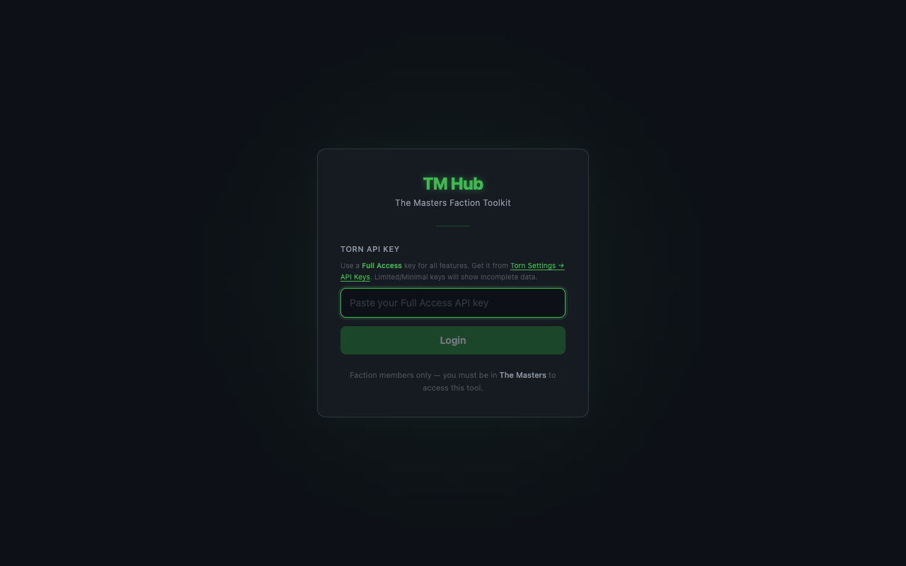
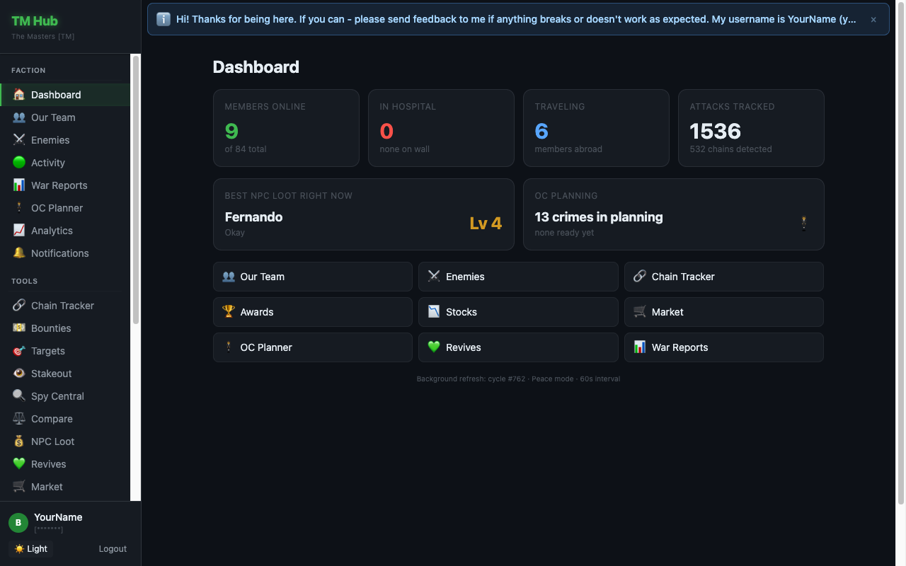
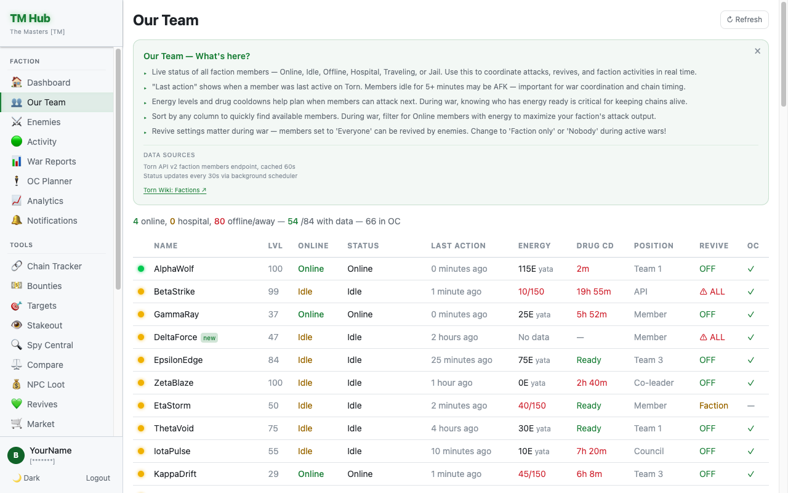
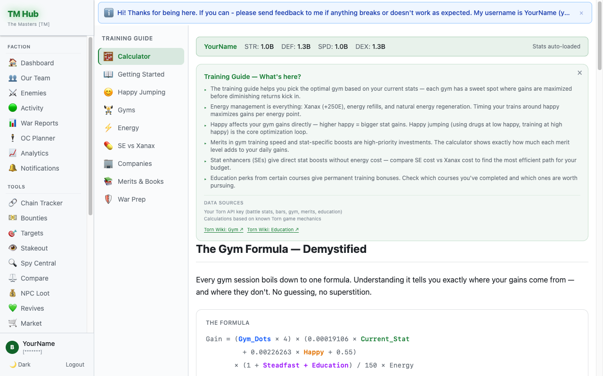
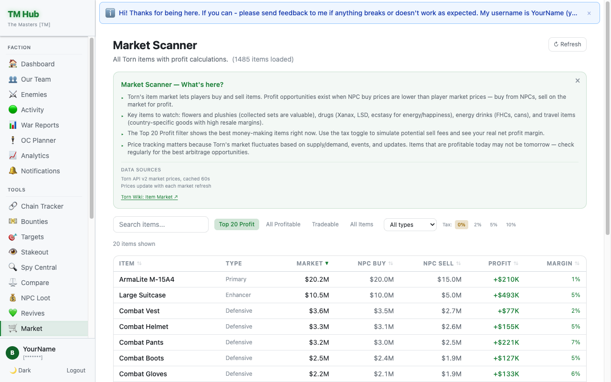
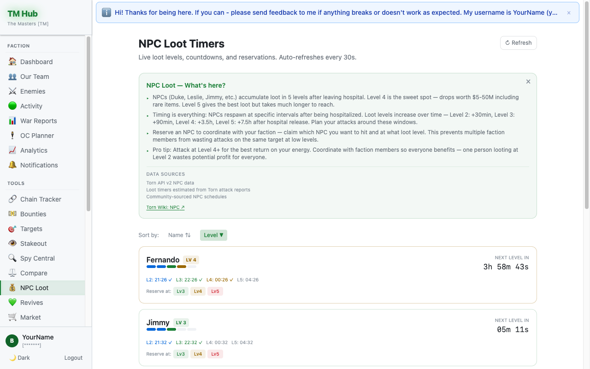
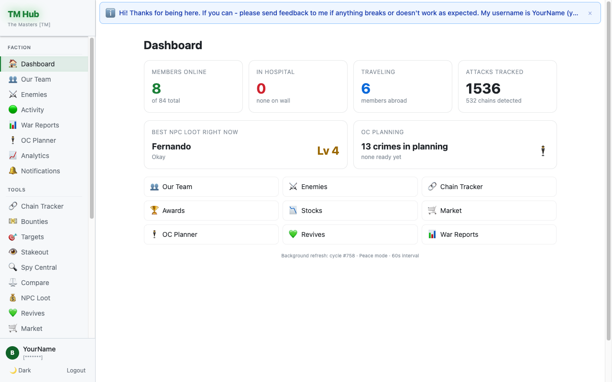

<p align="center">
  
</p>

<h1 align="center">TM Hub</h1>

<p align="center">
  <strong>Faction management toolkit for <a href="https://www.torn.com">Torn.com</a></strong><br/>
  Real-time member tracking, war coordination, training guides, market analysis, and more.
</p>

<p align="center">
  
  
  
  
  
  
</p>

---

## Overview

TM Hub is a self-hosted web application built for [Torn.com](https://www.torn.com) faction management. It pulls data from the Torn API, TornStats, and YATA to provide a unified dashboard for faction leaders and members.

**Key principles:**
- **Help players decide** — don't just display data, explain what it means and what action to take
- **Teach the game** — every page includes educational context about game mechanics
- **Show data sources** — transparency about where numbers come from
- **Always fresh** — background data refresh keeps everything up to date

> **Live instance:** [hub.tri.ovh](https://hub.tri.ovh) (faction members only)

---

## Screenshots

<table>
  <tr>
    <td align="center"><strong>Dashboard (Dark)</strong></td>
    <td align="center"><strong>Our Team</strong></td>
  </tr>
  <tr>
    <td></td>
    <td></td>
  </tr>
  <tr>
    <td align="center"><strong>Training Guide</strong></td>
    <td align="center"><strong>Market Scanner</strong></td>
  </tr>
  <tr>
    <td></td>
    <td></td>
  </tr>
  <tr>
    <td align="center"><strong>NPC Loot Timers</strong></td>
    <td align="center"><strong>Dashboard (Light)</strong></td>
  </tr>
  <tr>
    <td></td>
    <td></td>
  </tr>
</table>

> Player names in screenshots have been anonymized.

---

## Features

### Faction Management
| Feature | Description |
|---------|-------------|
| **Dashboard** | At-a-glance overview: online members, hospital, travelers, attacks, NPC loot, OC status |
| **Our Team** | Live member status — online/idle/offline, hospital timers, travel, energy, drug cooldowns, revive settings |
| **Enemies** | Auto-detect enemy from active Ranked War, threat scoring relative to your stats, attack buttons |
| **Activity** | Member status heatmap with online/idle/offline/hospital/traveling/jail filters |
| **War Reports** | Ranked war scores, raid history, territory battles |
| **OC Planner** | Organized crime status, participant roles, checkpoint pass rates |

### Tools
| Feature | Description |
|---------|-------------|
| **Chain Tracker** | Auto-detected chains from attack data, per-member breakdown, bonus hits |
| **Market Scanner** | 1,400+ items with live prices, NPC buy/sell, profit margins, tax simulation |
| **Spy Central** | Player search (TornStats + local DB), faction lookup, spy data management |
| **NPC Loot Timers** | Live loot levels, countdown timers, reservation system for faction coordination |
| **Stock Tracker** | Portfolio with P/L calculations, benefit/dividend progress, market overview |
| **Bounty Board** | Active bounties sorted by reward with attack links |
| **Target Lists** | Save and tag enemy targets with difficulty ratings and notes |
| **Stakeout** | Watch specific players, track status changes in real-time |
| **Revive Tracker** | Revive leaderboard (given/received, success rate), recent revives |
| **Travel Planner** | 11 countries with travel times, items abroad, market prices |
| **Company Tracker** | Company data and employee stats |
| **Player Compare** | Side-by-side stat comparison between players |
| **Armoury Competitions** | Create deposit competitions for categories or specific items, autocomplete item search, live leaderboards |

### Guides & Education
| Feature | Description |
|---------|-------------|
| **Training Guide** | Gym formula reference, happy jumping calculator, energy management, SE vs Xanax cost comparison |
| **Stat Growth** | Chart.js line charts, 30-day growth tracking, faction leaderboard |
| **Awards Tracker** | Honors & medals progress with category filters and detail subpages |
| **FAQ** | Common questions about Torn mechanics with detailed answers |
| **Userscripts** | Curated list of useful Torn userscripts |
| **Changelog** | Version history with per-player "new version" notification banner |

### Platform
- **Light/dark mode** with system preference detection
- **Mobile-first** responsive design with sidebar + bottom nav bar
- **Admin panel** — analytics dashboard, announcement editor, spy data management, role management
- **Push notifications** — browser notifications for important events
- **Background refresh** — all data stays fresh automatically
- **Faction chat** — built-in chat for faction coordination
- **Page explainers** — dismissible tutorial panel on every page

---

## Tech Stack

| Layer | Technology |
|-------|-----------|
| **Backend** | Python 3.12, FastAPI, SQLite (WAL mode), httpx, APScheduler 4 |
| **Frontend** | Next.js 16 (static export), React 19, TypeScript, Tailwind CSS v4, Chart.js |
| **Auth** | Torn API key validation → Fernet encryption → `X-Player-Id` header (HttpOnly cookie session) |
| **Integrations** | Torn API v1/v2, TornStats API, YATA API |
| **Runtime** | gunicorn + 2 uvicorn workers behind nginx; Redis for chat pub/sub, scheduler leader-election, shared rate limits |
| **Deploy** | Docker (multi-stage) → GitHub Actions → Coolify → VPS |
| **Testing** | 516 pytest tests (async), static export build verification |

---

## Architecture

```
api/
├── main.py                 # FastAPI app, lifespan, middleware
├── config.py               # Environment configuration
├── torn_client.py          # Torn/YATA/TornStats async client with TTL cache
├── threat.py               # Threat scoring engine (relative + absolute)
├── auth.py                 # JWT + rate limiting
├── admin.py                # Admin panel router
├── db/
│   ├── __init__.py         # KeyStore facade
│   ├── migrations/         # 41 versioned SQL migrations
│   └── repos/              # SQLite repositories (BaseRepository pattern)
├── services/               # Business logic (SpyService, etc.)
├── routers/                # Feature routers (22 route modules)
└── scheduler/              # APScheduler 4 background jobs (Redis leader-election)

frontend/src/
├── app/                    # Next.js pages (36 routes)
├── components/             # React components organized by domain
├── data/changelog.ts       # Version history + CURRENT_VERSION (semver)
├── hooks/                  # Data-fetching hooks (useAuth, useWarData, etc.)
├── lib/api-client.ts       # Centralized API wrapper with auth
└── types/                  # TypeScript interfaces
```

### Auth Flow

```
┌─────────┐    POST /api/keys     ┌─────────┐    Validate     ┌──────────┐
│ Browser  │ ──────────────────► │ Backend  │ ──────────────► │ Torn API │
│          │   (Torn API key)     │          │  (faction check) │          │
│          │ ◄────────────────── │          │ ◄────────────── │          │
│          │    player_id         │          │    member ✓     │          │
└─────────┘                      └─────────┘                  └──────────┘
     │                                │
     │  X-Player-Id header            │  Encrypted key stored
     │  on all API calls              │  in SQLite (Fernet)
     ▼                                ▼
```

Three roles: **superadmin** (hardcoded) → **admin** (DB flag) → **member**

---

## Development

### Prerequisites

- Python 3.12+ with [uv](https://docs.astral.sh/uv/)
- Node.js 20+ with npm

### Setup

```bash
# Clone and install
git clone https://github.com/pawelorzech/tm-war-room.git
cd tm-war-room

# Backend
uv sync
cp .env.example .env
# Edit .env with your Torn API key

# Frontend
cd frontend && npm install
```

### Running Locally

```bash
# Backend (port 8000)
TORN_API_KEY=xxx uvicorn api.main:app --reload --port 8000

# Frontend (port 3000)
cd frontend && npm run dev
```

### Testing

```bash
# Run all backend tests
uv run pytest tests/ -v

# Run specific test file
uv run pytest tests/test_threat.py -v

# Run by keyword
uv run pytest tests/test_routes.py -k "enemy"

# Frontend build verification (static export)
cd frontend && npm run build

# Lint
cd frontend && npm run lint
```

### Environment Variables

| Variable | Required | Default | Description |
|----------|----------|---------|-------------|
| `TORN_API_KEY` | Yes | — | Torn API key for server-side requests |
| `ENCRYPTION_KEY` | Yes* | auto-generated | Fernet key for encrypting stored API keys |
| `JWT_SECRET` | Yes* | auto-generated | JWT signing key for admin auth |
| `TORNSTATS_API_KEY` | No | — | TornStats API access |
| `FACTION_ID` | No | `11559` | Target faction ID |
| `CACHE_TTL` | No | `60` | Torn API cache TTL in seconds |
| `SUPERADMIN_IDS` | No | `2362436` | Comma-separated allowlist of superadmin player IDs (break-glass) |
| `REDIS_URL` | Recommended (prod) | — | `redis://...`. Enables cross-worker chat pub/sub, scheduler leader-election, shared rate limits |
| `WEB_CONCURRENCY` | No | `2` | gunicorn worker count. Multi-worker requires `REDIS_URL` |
| `BACKUP_ENCRYPTION_KEY` | Recommended (prod) | — | Fernet key for daily encrypted `keys.db` backups (store outside Coolify) |
| `BACKUP_RETENTION_DAYS` | No | `30` | Days of encrypted backups to retain |
| `B2_APPLICATION_KEY_ID` / `B2_APPLICATION_KEY` / `B2_BUCKET_NAME` / `B2_PUBLIC_URL` | No | — | Backblaze B2 credentials for avatar refresh and encrypted DB backups |

\* Auto-generated if missing in dev/test (ephemeral — keys reset on restart). **Fails fast in production** (`APP_VERSION != "dev"`).

---

## Deployment

Push to `master` triggers the CI/CD pipeline:

```
git push origin master
    │
    ▼
GitHub Actions ─── pytest + build ──► Coolify webhook ──► Docker build ──► Live
```

The Docker image uses a multi-stage build: Node.js builds the static frontend, Python serves everything via FastAPI with static file mounting.

| URL | Target |
|-----|--------|
| `hub.tri.ovh` | Main application |
| `rw.tri.ovh` | Redirect → `/team` |
| `train.tri.ovh` | Redirect → `/training` |

---

## License

Private tool built for The Masters [TM] faction. Not intended for general distribution.
